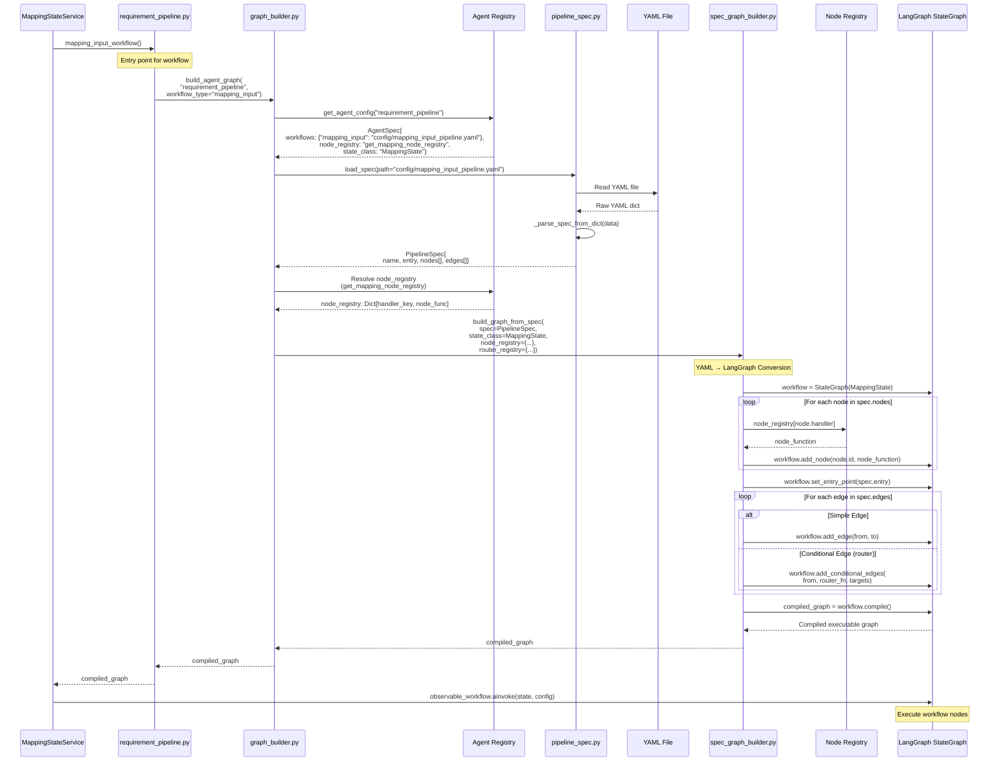

```mermaid
sequenceDiagram
    participant Service as MappingStateService
    participant Entry as requirement_pipeline.py
    participant Framework as graph_builder.py
    participant Registry as Agent Registry
    participant Loader as pipeline_spec.py
    participant YAML as YAML File
    participant Builder as spec_graph_builder.py
    participant NodeReg as Node Registry
    participant LangGraph as LangGraph StateGraph
    
    Service->>Entry: mapping_input_workflow()
    Note over Entry: Entry point for workflow
    
    Entry->>Framework: build_agent_graph(<br/>"requirement_pipeline",<br/>workflow_type="mapping_input")
    
    Framework->>Registry: get_agent_config("requirement_pipeline")
    Registry-->>Framework: AgentSpec{<br/>workflows: {"mapping_input": "config/mapping_input_pipeline.yaml"},<br/>node_registry: "get_mapping_node_registry",<br/>state_class: "MappingState"}
    
    Framework->>Loader: load_spec(path="config/mapping_input_pipeline.yaml")
    Loader->>YAML: Read YAML file
    YAML-->>Loader: Raw YAML dict
    Loader->>Loader: _parse_spec_from_dict(data)
    Loader-->>Framework: PipelineSpec{<br/>name, entry, nodes[], edges[]}
    
    Framework->>Registry: Resolve node_registry<br/>(get_mapping_node_registry)
    Registry-->>Framework: node_registry: Dict[handler_key, node_func]
    
    Framework->>Builder: build_graph_from_spec(<br/>spec=PipelineSpec,<br/>state_class=MappingState,<br/>node_registry={...},<br/>router_registry={...})
    
    Note over Builder: YAML → LangGraph Conversion
    
    Builder->>LangGraph: workflow = StateGraph(MappingState)
    
    loop For each node in spec.nodes
        Builder->>NodeReg: node_registry[node.handler]
        NodeReg-->>Builder: node_function
        Builder->>LangGraph: workflow.add_node(node.id, node_function)
    end
    
    Builder->>LangGraph: workflow.set_entry_point(spec.entry)
    
    loop For each edge in spec.edges
        alt Simple Edge
            Builder->>LangGraph: workflow.add_edge(from, to)
        else Conditional Edge (router)
            Builder->>LangGraph: workflow.add_conditional_edges(<br/>from, router_fn, targets)
        end
    end
    
    Builder->>LangGraph: compiled_graph = workflow.compile()
    LangGraph-->>Builder: Compiled executable graph
    Builder-->>Framework: compiled_graph
    Framework-->>Entry: compiled_graph
    Entry-->>Service: compiled_graph
    
    Service->>LangGraph: observable_workflow.ainvoke(state, config)
    Note over LangGraph: Execute workflow nodes
```
